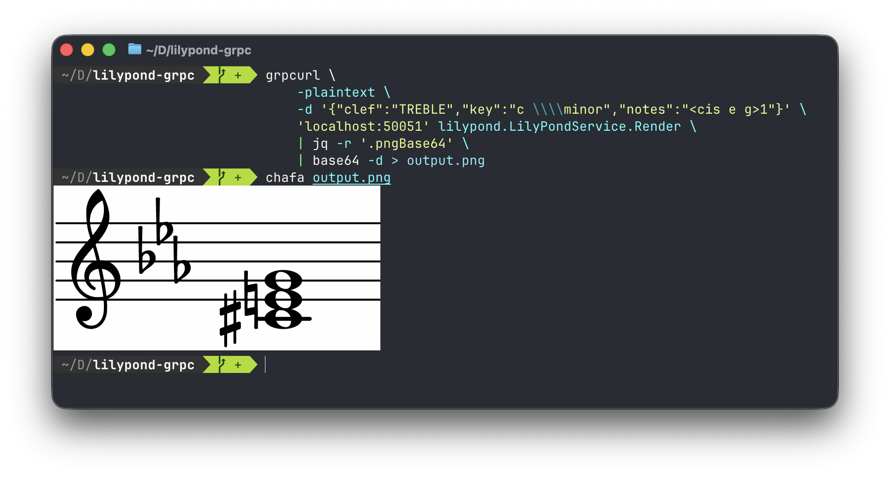

# lilypond-grpc

A gRPC server that renders [LilyPond](https://lilypond.org/) music notation to PNG images. It manages a pool of LilyPond processes for concurrent rendering and returns cropped, high-resolution images as base64-encoded PNGs.

## Example



## Prerequisites

- [Rust](https://rustup.rs/) (1.85+)
- [LilyPond](https://lilypond.org/download.html) (2.24.x)
- [Protocol Buffers compiler](https://grpc.io/docs/protoc-installation/) (`protoc`)

### macOS

```bash
brew install lilypond protobuf
```

### Debian/Ubuntu

```bash
sudo apt-get install lilypond protobuf-compiler
```

## Building

```bash
git clone https://github.com/youruser/lilypond-grpc.git
cd lilypond-grpc
cargo build --release
```

## Running

```bash
cargo run --release
```

The server starts on `0.0.0.0:50051` by default.

### Environment Variables

| Variable | Default | Description |
|----------|---------|-------------|
| `LISTEN_ADDR` | `0.0.0.0:50051` | Address and port to listen on |
| `LILYPOND_POOL_SIZE` | `4` | Max concurrent LilyPond renders |
| `LILYPOND_BIN` | `lilypond` | Path to the LilyPond binary |
| `RUST_LOG` | `lilypond_grpc=info` | Log level |

Example:

```bash
LILYPOND_POOL_SIZE=8 LISTEN_ADDR=0.0.0.0:9090 RUST_LOG=lilypond_grpc=debug cargo run --release
```

## Docker

```bash
docker build -t lilypond-grpc .
docker run -p 50051:50051 lilypond-grpc
```

## API

### Proto Definition

```protobuf
enum Clef {
  TREBLE = 0;
  BASS = 1;
  ALTO = 2;
  TENOR = 3;
  SOPRANO = 4;
  MEZZO_SOPRANO = 5;
  BARITONE = 6;
  PERCUSSION = 7;
  TAB = 8;
}

message RenderRequest {
  Clef clef = 1;
  string key = 2;       // e.g. "c \major", "d \minor", "bes \major"
  string notes = 3;     // e.g. "<c e g>1", "c4 d e f"
}

message RenderResponse {
  string png_base64 = 1;  // base64-encoded PNG image
  string error = 2;       // empty on success
}

service LilyPondService {
  rpc Render (RenderRequest) returns (RenderResponse);
}
```

### Defaults

If fields are omitted, the following defaults are used:

| Field | Default |
|-------|---------|
| `clef` | `TREBLE` |
| `key` | `c \major` |
| `notes` | `<c e g>1` |

### LilyPond Template

Each request renders the following template:

```lilypond
\version "2.24.0"

\relative c' {
  \omit Staff.TimeSignature
  \omit Staff.BarLine
  \clef {clef}
  \key {key}
  {notes}
}
```

### Notes Syntax

Notes use standard [LilyPond notation](https://lilypond.org/doc/v2.24/Documentation/notation/):

| Example | Description |
|---------|-------------|
| `c4 d e f` | Quarter notes: C D E F |
| `<c e g>1` | Whole note C major chord |
| `<cis e g>1` | C♯ minor chord (sharp = `is`) |
| `<ces e g>1` | C♭ chord (flat = `es`) |
| `r4 c8 d e4 f` | Rest, eighth notes, quarters |

## Clients

### Rust Test Client

```bash
# Default render (treble, C major, C major chord)
cargo run --bin test_client

# Custom render
cargo run --bin test_client -- treble "d \\minor" "d4 e f g" output.png

# Bass clef
cargo run --bin test_client -- bass "c \\major" "<c e g>1" bass_chord.png
```

### grpcurl

```
grpcurl \
	-plaintext \
	-emit-defaults \
	-d '{"clef":"TREBLE","key":"c \\\\major","notes":"<cis e g>1"}' \
	'localhost:50051' lilypond.LilyPondService.Render
```

### Postman

1. Create a new **gRPC** request
2. Enter `localhost:50051` as the server URL
4. Select **LilyPondService / Render**
5. Enter the message body:
   ```json
   {
     "clef": "TREBLE",
     "key": "c \\major",
     "notes": "<cis e g>1"
   }
   ```
6. Click **Invoke**

## Architecture

```
┌───────────┐       gRPC       ┌───────────────┐      subprocess     ┌──────────┐
│  Client   │ ───────────────▶ │  Tonic Server │ ──────────────────▶ │ LilyPond │
│           │ ◀─────────────── │               │ ◀────────────────── │          │
│           │   base64 PNG     │  Process Pool │    cropped PNG      │          │
└───────────┘                  └───────────────┘   (temp directory)  └──────────┘
                                     │
                                     │ Semaphore
                                     │ (max N concurrent)
                                     ▼
                               ┌──────────────┐
                               │ LilyPond (N) │
                               └──────────────┘
```

## License

MIT
